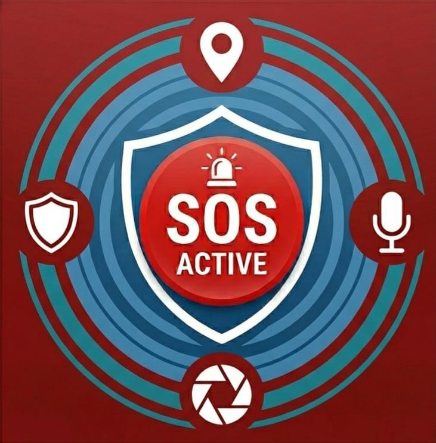

# 🛡️ Public Emergency App: Advanced Real-Time Emergency Response Platform

**Public Emergency App** is a next-generation safety platform designed to bridge the gap between citizens in distress and emergency responders. By leveraging real-time data and intelligent location tracking, it ensures that help is always just one tap away.



## 🚀 Key Features

### For Citizens (SOS Mode)
- **Instant SOS**: A single-tap distress trigger that immediately alerts local responders and emergency contacts.
- **Smart SMS Alerts**: Sends stealthy, automated SMS messages with your precise GPS coordinates, map link, and street address directly to your designated emergency contacts, without interrupting your session.
- **Direct Emergency Calling**: Dedicated quick-access buttons that automatically dial Police, Medical, and Fire services.
- **Proximity Search**: Find and navigate to the nearest hospitals, police stations, and fire departments using embedded Google Maps and Apple Maps routing.

### For Responders (Hero Dashboard)
- **Real-Time Dispatch**: Responders receive instant notifications for emergencies within their designated radius (e.g., 15km).
- **Precise Navigation**: Integrated high-accuracy location tracking and turn-by-turn navigation directly to the victim's exact coordinates.
- **Availability Management**: Simple tracking switch to toggle active/inactive status for local duty coordination.

## 🛠️ Technology Stack

- **Frontend Framework**: [Flutter (Dart)](https://flutter.dev/) for high-performance cross-platform mobile delivery.
- **State Management**: [GetX](https://pub.dev/packages/get) for reactive and lightweight dependency injection and routing.
- **Real-time Backend & Database**: [Firebase Authentication](https://firebase.google.com/) for secure identity management, and **Firebase Realtime Database** for instant location and SOS synchronization.
- **Geospatial & Environment Services**: [Geolocator](https://pub.dev/packages/geolocator) for precise tracking, [Geocoding](https://pub.dev/packages/geocoding) for map translations, and **Background SMS** for critical physical network messaging.
- **Map Integrations**: Utilizing Google Maps and Apple Maps URL intents for real-time proximity and turn-by-turn routing.

## 📦 Installation & Setup

### Prerequisites
- Flutter SDK (Latest Stable)
- Android Studio / VS Code
- A Firebase Project with Google Services enabled

### Getting Started
1. **Clone the repository**:
   ```bash
   git clone https://github.com/aadityaverma08/Public-Emergency-app.git
   cd Public-Emergency-app
   ```

2. **Initialize dependencies**:
   ```bash
   flutter pub get
   ```

3. **Configure Firebase**:
   - Add your `google-services.json` to `android/app/`.

4. **Run the application**:
   ```bash
   flutter run
   ```

## 🛡️ License

This project is developed for hackathon demonstration purposes. All rights reserved.

---
*Built with ❤️ for a safer tomorrow.*
